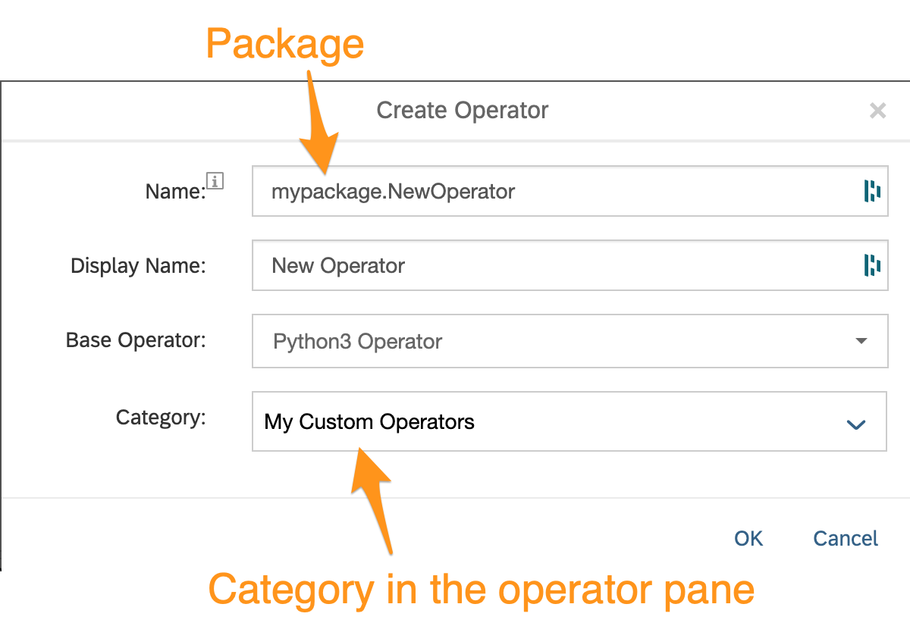
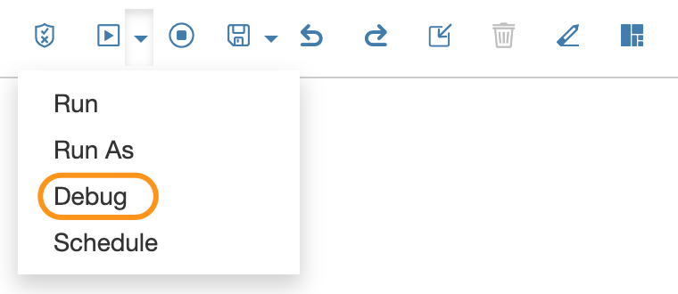
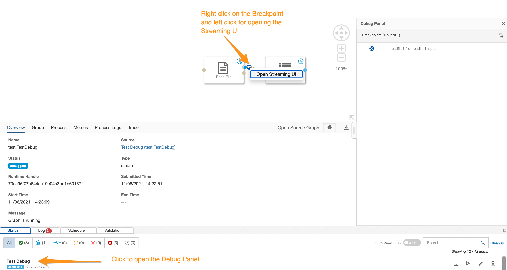
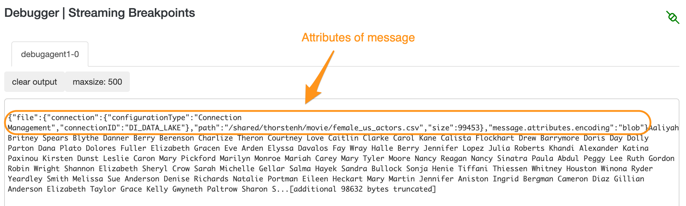
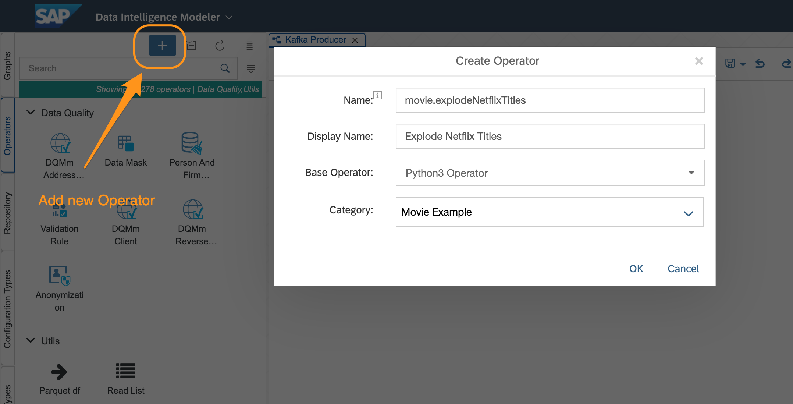
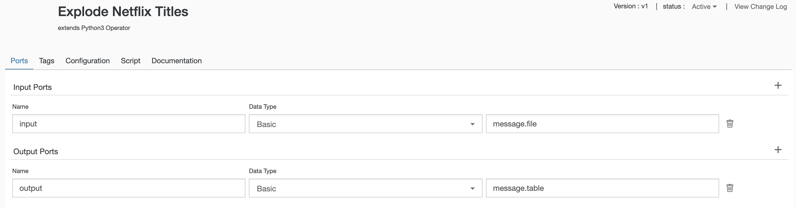
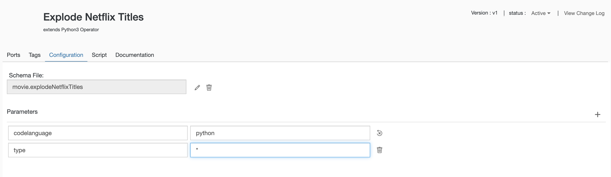
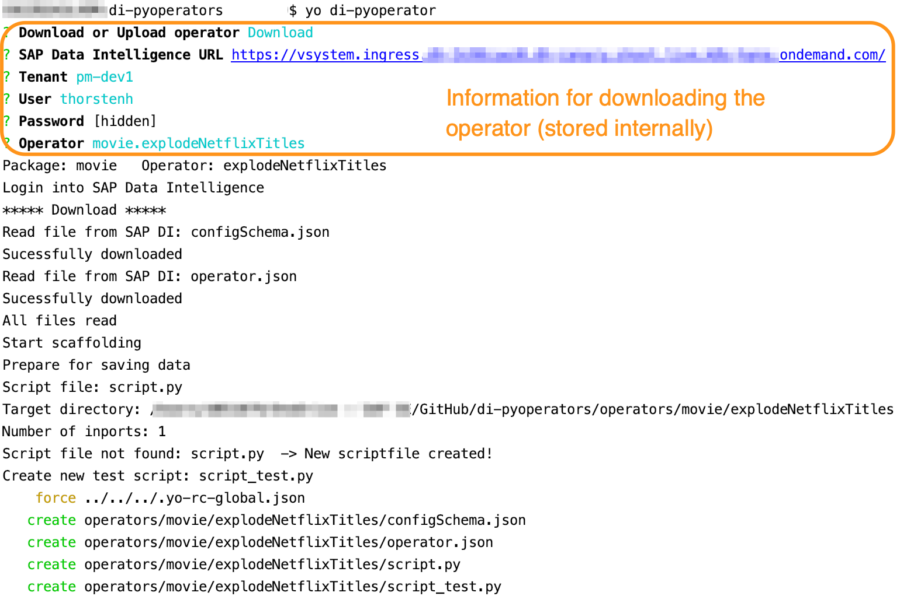
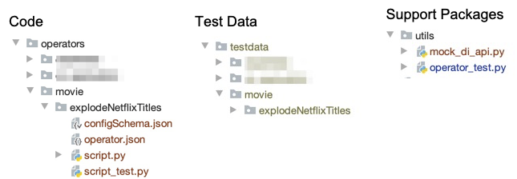

[](https://api.reuse.software/info/github.com/SAP-samples/data-intelligence-pyoperator-generator)

# generator-di-pyoperator

Yeoman generator for developing and testing standalone/offline SAP Data Intelligence python operators. 

The main features are

* Downloading from Data Intelligence instances and
* Uploading the operators
* Providing a 'mock-api'-package
* Creating operator python script if it does not exist
* Adding 'mock-api'-imports for offline development
* Creating a separate test script for testing the operator-script
* Providing a 'operator-test' package for mimicking inport-data

** ATTENTION**: This only works properly for operators created within a package, this means when creating a new operator the name should be preceded by a package-name like ```<package>.<operator>```.


## Description

### Usage: CLI call
```yo di-operator [--init] [--overwrite]```

```--init``` creates the folders needed for the project and saves the 'mock-di-api.py' to 'utils/. You only need this option for initializing the project. Attention: If you have modified 'mock-di-api' it will be overridden.

```--overwrite``` creates the script.py and script_test.py newly and overwrites existing python scripts. 


### Prompts

1. Download from DI or Upload to DI (stored)  
2. SAP Data Intelligence URL (stored)
3. Tenant (stored, default = 'default')
4. User (stored): Sap Data Intelligence user of Workspace
5. Password (stored): Sap Data Intelligence user password of Workspace
6. Operator (stored): Operator name (=folder name in vflow)


## Documentation

The whole intention of this project is to ease the development of Python operators by connecting a local IDE with an SAP Data Intelligence instance. Because there is no connection with an DI instance except during the download and upload process you need to mock the APIs of DI. In addition to this I thought some code structure might be helpful when creating an operator script. The premise is that most Python operators are working with data provided as a csv-byte stream, message or message.table therefore the scaffold code is providing utilities for this kind of formats. Of course you can always remove the unused code.  

## Project Folder Structure

di-pyoperator expects the following project structure that is created with the ```--init``` option. 

* ```operators``` - where all the the Data Intelligence operators are stored
* ```utils``` - that stores the support packages **mock_di_api** and **operator_test** 
* ```testdata``` - that keeps all test data for the operator. For each operator a separate folder is created


## Download operator-Files

di-pyoperator downloads all operator files from the SAP Data Intelligence user workspace to the project folder 

```<project>/operators/<operator-package>/<operator>````

Please be aware that di-pyopertor is only tested with operators created in SAP Data Intelligence that belongs to  a package. This can be ascertained by adding the package name with a dot before the operator name. 



## Operator Script File

This release is not supporting the operator development from scratch but is based of the upfront operator creation in the Data Intelligence modeler. If nothing is added to the script-editor in the modeler then no script-file is created by Data Intelligence. 

If there is no script-file to which the operator.json attribute ```config:script```is referencing to a new ```script.py``` is created with the necessary scaffolding. 


Depending on the operator definitions some code snippets are added to the general structure of the script file: 
```
# First 3 lines generated by di-pyoperator - DO NOT CHANGE (Deleted again when uploaded.)
from utils.mock_di_api import mock_api
api = mock_api(__file__)

def on_input(msg) :

	out_msg = None
	api.send('output',out_msg)


api.set_port_callback('input',on_input)

```
For each inport the callback-call and the callback-function is created (naming convention:'on_'<port>).  The first 3-lines of the script with the import of the mock-di-api package is going to be deleted once it is uploaded. 

### Import Section

For all custom operators the following operators are added per default: 

```
import pandas as pd
import copy 
```

If the inport data type is of **message.file** then ```import io``` is added for createing an streaming buffer.

If there is an outport data type of **message.file** then ``import os``` to provide the useful *path.join* function. 


#### import pandas

Due to the fact that in most cases table structures are processed pandas is mostly needed

#### import copy

The copy-package supports the deep copying of dictionaries that ensures that embedded references are not overwritten accidentally by other operator calls. 

### Inports

If there are inports then for each inport a callback function is created and the corresponding api-call:

```   
def on_input(msg) :

...

api.set_port_callback('input',on_input)   # datatype: message.file
```

and if no inport is defined then a generator-function is created: 

```   
def gen() :

...

api.add_generator(gen)
```

If the operator needs to process together input from more than one inport you have to manually merge the callback-functions and the api.call, e.g.

```
def on_input(msg1,msg2) :

...

api.set_port_callback(['input1','input2'],on_input)   # datatype: message.file

```

### Outports

For the following outport data types 

* message.table
* message.file
* message
* else

```api.send(port,data)``` code snippets are created that prepare the data accordingly. 


## Test Script: script_test.py

When the script.py is generated an accompanying test-script is generated as well that let you call the operator script and provides some basic methods to support the tests. 

```
# Imports needed to be run the test
import script
from utils.mock_di_api import mock_api
from utils.operator_test import operator_test
       
# Mock API definition 
api = mock_api(__file__)     # class instance of mock_api
mock_api.print_send_msg = True  # set class variable for printing api.send

# Class supporting the tests
optest = operator_test(__file__)

# config parameter 
api.config.num_files = 'null'    # datatype : number
api.config.prefix = None   # datatype : string

# Loading the inport data
msg = optest.get_file('test_file.csv')

# Call of the operator script
script.on_input(msg)

# Additional option to print the send messages
# print result list
for mt in mock_api.msg_list :
  print('*********************')
  print('Port: {}'.format(mt['port']))
  print('Attributes: {}'.format(mt['data'].attributes))
  print('Data: {}'.format(mt['data'].body))
  #print(optest.msgtable2df(mt['data']))  
  
```


For the standalone testing of an operator you need input data of the format specified in the operator.json 'inports' attribute. Commonly used formats are: 

* message
* message.file 
* message.table

For the details of the required attributes you can run the pipeline until where the custom operator needs to be added in the DEBUG-mode. Then you can copy the attributes and paste it to your script_test.py file. 







To support these there are methods of the operator_test class that reads a testfile from the folder ```testdata/<package>/<operator>/<testfile>```

* ```get_msg(<testfile>)``` -> message with attributes and body (storing json-compatible formats only) stored as json.
* ```get_msgfile(<testfile>)``` -> message with generic attributes and the body read from file and stored as byte-code
* ```get_msgtable(<testfile>)``` -> message with generic attributes and body read from csv-file and stored as 2-dim array.

The corresponding folder for each package.operator is created when the operator is downloaded for the first time.


## Example - Explode an Embedded Column in CSV-File

As an example I took a requirement that is a bit too complex at least for my level of expertise to do it without some preliminary testing: exploding an embedded list in a csv-file.  

From Kaggle you can download a [csv-file of Netflix-titles](https://www.kaggle.com/shivamb/netflix-shows) that has a column containing the cast of the movie/tv. Because you are interested in the actors you like to explode the cast-column as a separate column to produce a flat table and send the result as a message.table to the outport. Additionally you like to filter the data on movie or tv. 

### Define the Operator in SAP Data Intelligence

Add a new operator 'movie.explodeNetflixTitles' in the SAP Data Intelligence Modeller



and the basic information

* Inport and Outport 
  * input - basic - message.file
  * output - basic - message.table
* Configuration
  * type - Type - string
  
The script kept unchanged. This will be added offline. 





### Offline Development

Open your favourite python IDE  (In the example case it is Pycharm) and 

1. Create a project-folder 
2. Open a terminal window
3. Enter the command ```yo di-pyoperator``` and add the required information. If it is the first call add the option ```--init```



All files are downloaded and the script-code has already initialized for a quick-start:



```
# First 3 lines generated by di-pyoperator - DO NOT CHANGE (Deleted again when uploaded.)
from utils.mock_di_api import mock_api
api = mock_api(__file__)

import pandas as pd
import copy
import io


def on_input(msg) :

    # Due to input-format PROPOSED transformation into DataFrame
    df = pd.read_csv(io.BytesIO(msg.body))

    # config parameter 
    #api.config.type = '*'    # datatype : string


    # Sending to outport output
    # Due to output-format PROPOSED transformation into message.table
    #df.columns = map(str.upper, df.columns)  # for saving to DB upper case is usual
    columns = []
    for col in df.columns : 
        columns.append({"class": str(df[col].dtype),'name': col})
    att = copy.deepcopy(msg.attributes)
    att['table'] = {'columns':columns,'name':'TABLE','version':1}
    out_msg = api.Message(attributes=att, body= df.values.tolist())
    api.send('output',out_msg)    # datatype: message.table

api.set_port_callback('input',on_input)   # datatype: message.file
```

Now you add your custom code. The following are my result based on several trials like learning that there are some titles without a cast.
```
    ### Custom Code
    df = df[['title', 'type', 'cast', 'release_year']]
    df = df.loc[df['cast'].notna()]
    df['cast'] = df['cast'].apply(lambda x: x.split(','))
    df = df.explode('cast')
    df = df.rename(columns={'cast': 'ACTOR'})
    df['ACTOR'] = df['ACTOR'].str.strip()
```

For testing you can download the data from [Kaggle](https://www.kaggle.com/shivamb/netflix-shows) and store it to the folder ```<your project>/testdata/movie/explodeNetflixTitles```.

Data extraction: 
```
show_id,type,title,director,cast,country,date_added,release_year,rating,duration,listed_in,description
s1,TV Show,3%,,"João Miguel, Bianca Comparato, Michel Gomes, Rodolfo Valente, Vaneza Oliveira, Rafael Lozano, Viviane Porto, Mel Fronckowiak, Sergio Mamberti, Zezé Motta, Celso Frateschi",Brazil,"August 14, 2020",2020,TV-MA,4 Seasons,"International TV Shows, TV Dramas, TV Sci-Fi & Fantasy","In a future where the elite inhabit an island paradise far from the crowded slums, you get one chance to join the 3% saved from squalor."
s2,Movie,7:19,Jorge Michel Grau,"Demián Bichir, Héctor Bonilla, Oscar Serrano, Azalia Ortiz, Octavio Michel, Carmen Beato",Mexico,"December 23, 2016",2016,TV-MA,93 min,"Dramas, International Movies","After a devastating earthquake hits Mexico City, trapped survivors from all walks of life wait to be rescued while trying desperately to stay alive."

```

Modify the script_test.py for running the local test by just replacing the name of the test-file:
```
msg = optest.get_msgfile('netflix_titles.csv')
```

When the code is doing what you intended it should then you can upload the operator using the commandline: 

```yo di-pyoperator``` and selecting 'Upload'. All the parameters have been stored when the operator was downloaded. 

When the operator is sucessfully uploaded you can integrate the operator into your graph and move on with your pipeline development. 
 

## Requirements

* SAP Data Intelligence - System Management Command-Line Client (vctl) 
* Yeoman
* di-pyoperator (published package or use code of this repository)

## Download and Installation

### System Management Command-Line Client (vctl) 
The whole interaction works with vctl. Please have a look to the [documentation](https://help.sap.com/viewer/0b99871a1d994d2ea89598fe59d16cf9/3.0.latest/en-US/b13e0b4fe2574b3881e3c7ef1ad2a640.html) for downloading the script. 

### YEOMAN
Yeoman is a scaffolding tool creating the framework and templates that you need for a quick start. The generator is based on YEOMAN and you find more information who to write yeoman generators on [yeoman.io](https://yeoman.io/authoring/).

1. Installing ```npm```, a JavaScript software registry and package installation tool 
    * MacOs: ```brew install node``` 
2. Installing yeoman
    * ```npm install -g yo````
3. Installing the di-pyoperator generator
    * ```npm install -g generator-di-pyoperator```

### Local SAP Data Intelligence Operator deployment

For developing the operators locally you do not need a git repository. I have created a personal gitHub repository for all my custom operators that I clone. Most of the python-IDEs might have an integrated git and a remote repository integration, at least VSCode and PyCharm does. 

0. Create Git - Repository <project>
1. Clone repository locally or make project directory <project>
2. ```cd project````
3. Run yo-generator for preparing local DI operator development 
    
    a. ```yo di-pyoperator --init``` - in case to prepare the development environmentm and download your first operator
    
    b.```yo di-pyoperator ``` - Next time you want to download/upload an opertor for offline development


## Known Issues

### Rather a deliberate shortcoming:

Currently the up- and download only works for SAP DI operators incorporated in a package (name the operators with a preceding '.': <mypackage>.<myoperator>. It always should be a good practise to create operators belonging to a package. 

### Open due to undecided necessity: 

Create new operator offline

## How to obtain support

I am using this tool myself and have therefore an intrinsic motivation for improving the code and extending it with useful features. Nonetheless my main job is a Product Manager for SAP Data Intelligence.  

[Create an issue](https://github.com/SAP-samples/data-intelligence-pyoperator-generator/issues) in this repository if you find a bug or have questions about the content.
 
For additional support, [ask a question in SAP Community](https://answers.sap.com/questions/ask.html).

## Contributing

All support is appreciated. For SAP employees I can add you to the project while for non-SAP employees I would add coding to the script and state your contribution in this section.

The code of the generator is in the folder [generator-di-pyoperator](./generator-di-pyoperator) where you can modify the [index.js](./generator-di-pyoperator/generators/app/index.js).

## License
Copyright (c) 2021 SAP SE or an SAP affiliate company. All rights reserved. This project is licensed under the Apache Software License, version 2.0 except as noted otherwise in the [LICENSE](LICENSES/Apache-2.0.txt) file.


